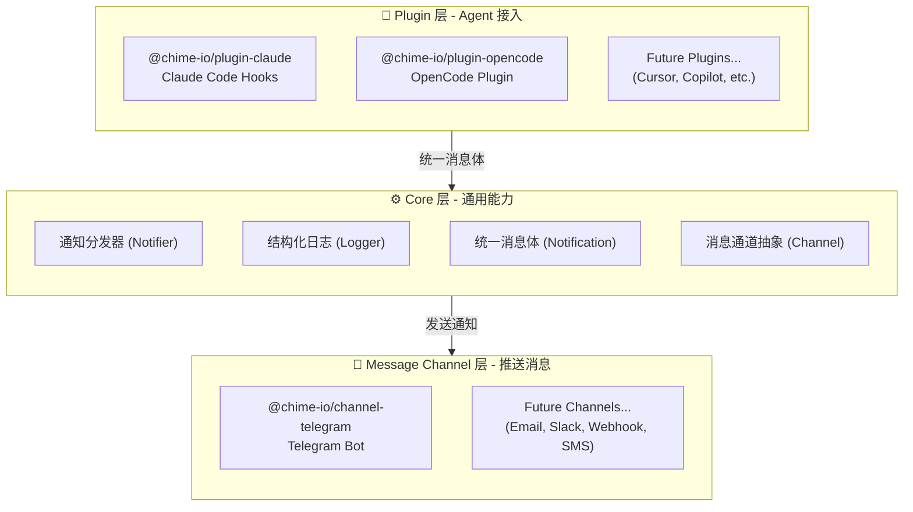
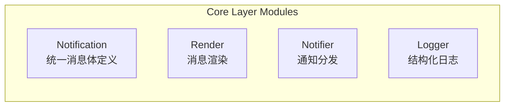
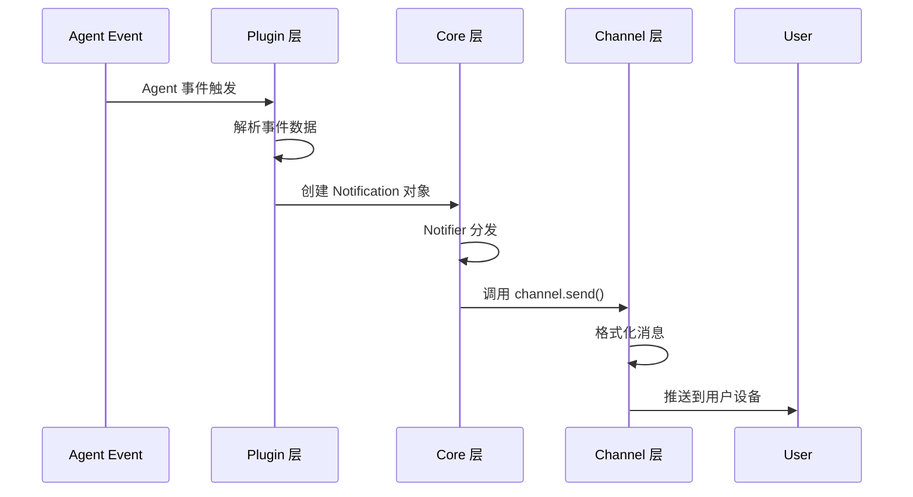
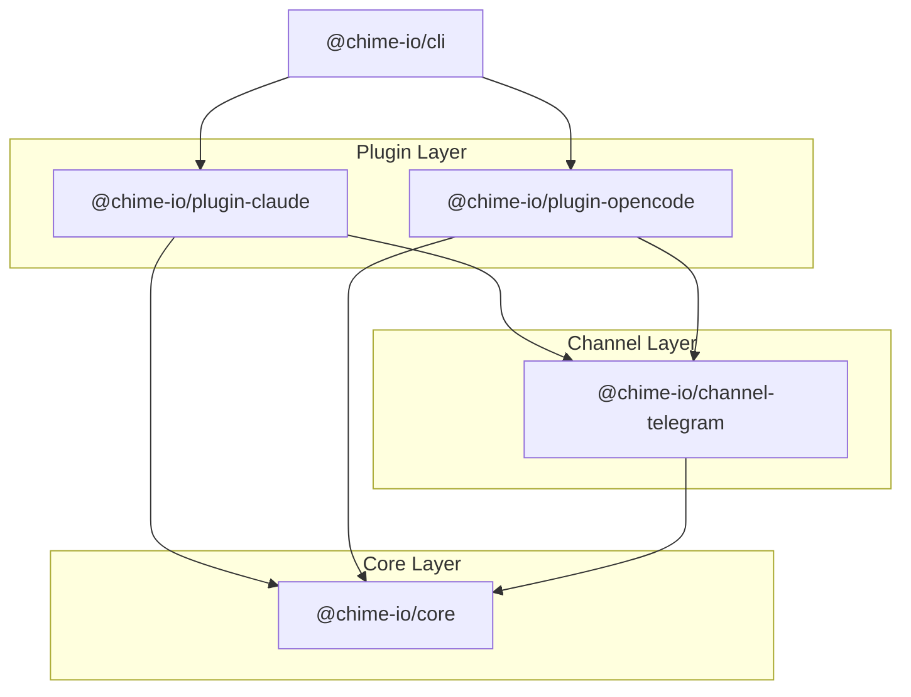

# Chime Notify 项目架构文档

本文档描述 Chime Notify 项目的整体架构设计、分层方式及演进规划。

## 快速导航

- [AGENTS.md](../CLAUDE.md) - 开发者快速上手指南
- [README.md](../README.md) - 项目介绍与使用说明

---

## 架构分层图



---

## 详细分层说明

### 1. Plugin 层（Agent 接入层）

**职责**：处理各类 Agent 的事件消息，转换为统一的消息体格式

**当前实现**：

| 包名 | 说明 | 入口文件 |
|------|------|----------|
| `@chime-io/plugin-claude` | Claude Code 的 hooks 实现 | `src/notify-*.ts` |
| `@chime-io/plugin-opencode` | OpenCode 的 plugin 实现 | `src/index.ts` |

**处理的事件类型**：
- `session.stop` - 会话结束通知
- `permission.request` - 权限请求通知
- `notification` - 一般通知
- `question` - 用户提问通知
- `tool.failure` - 工具执行失败通知
- `subagent.complete` - 子代理完成通知

### 2. Core 层（通用能力层）

**职责**：提供可复用的核心能力，与具体 Agent 和 Channel 解耦

**模块组成**：



**核心接口**：

```typescript
// 统一消息体
interface Notification {
  agent: string;        // 消息来源 Agent
  kind: string;         // 消息类型
  title: string;        // 标题
  lines: string[];      // 内容行
  metadata: Record<string, unknown>; // 元数据
}

// 消息通道
interface NotificationChannel {
  id: string;
  send(notification: Notification): Promise<unknown>;
}

// 通知器
interface Notifier {
  notify(notification: Notification): Promise<void>;
}
```

### 3. Message Channel 层（推送层）

**职责**：负责将消息推送到具体的外部服务

**当前实现**：

| 包名 | 说明 | 支持功能 |
|------|------|----------|
| `@chime-io/channel-telegram` | Telegram Bot 推送 | HTML/Markdown 格式、静默消息 |

**规划扩展**：
- `@chime-io/channel-slack` - Slack 消息推送
- `@chime-io/channel-email` - 邮件推送
- `@chime-io/channel-webhook` - 通用 Webhook
- `@chime-io/channel-sms` - 短信推送

---

## 数据流



---

## 项目演进规划

### Phase 1: 基础能力（已完成）

- ✅ Core 层基础接口设计
- ✅ Telegram Channel 实现
- ✅ Claude Code Plugin 实现
- ✅ OpenCode Plugin 实现

### Phase 2: 增强核心（进行中）

- 🔄 Logger 模块增强（日志轮转、结构化日志）
- ⏳ 消息队列支持（处理高峰期消息）
- ⏳ 消息模板系统（支持自定义模板）

### Phase 3: 扩展通道（规划中）

- ⏳ Slack Channel
- ⏳ Email Channel
- ⏳ Webhook Channel
- ⏳ 企业微信/钉钉 Channel

### Phase 4: 高级功能（未来）

- ⏳ 消息过滤与路由规则
- ⏳ 通知聚合与批量发送
- ⏳ 消息历史与搜索
- ⏳ 用户偏好设置

---

## 依赖关系



---

## 技术栈

- **语言**: TypeScript 5.8+
- **运行时**: Node.js 20-25
- **包管理**: pnpm 10.x
- **Monorepo**: Rush Stack
- **构建**: tsup
- **测试**: Node.js Test Runner

---

## 开发规范

1. **依赖方向**: Plugin → Core ← Channel，禁止循环依赖
2. **扩展规范**: 新增 Plugin/Channel 需实现 Core 层接口
3. **测试要求**: 所有包需包含单元测试，测试从源码导入
4. **TypeScript**: 使用 `.ts` 扩展名导入源码

---

*文档版本: 1.0 | 最后更新: 2026-04-11*
